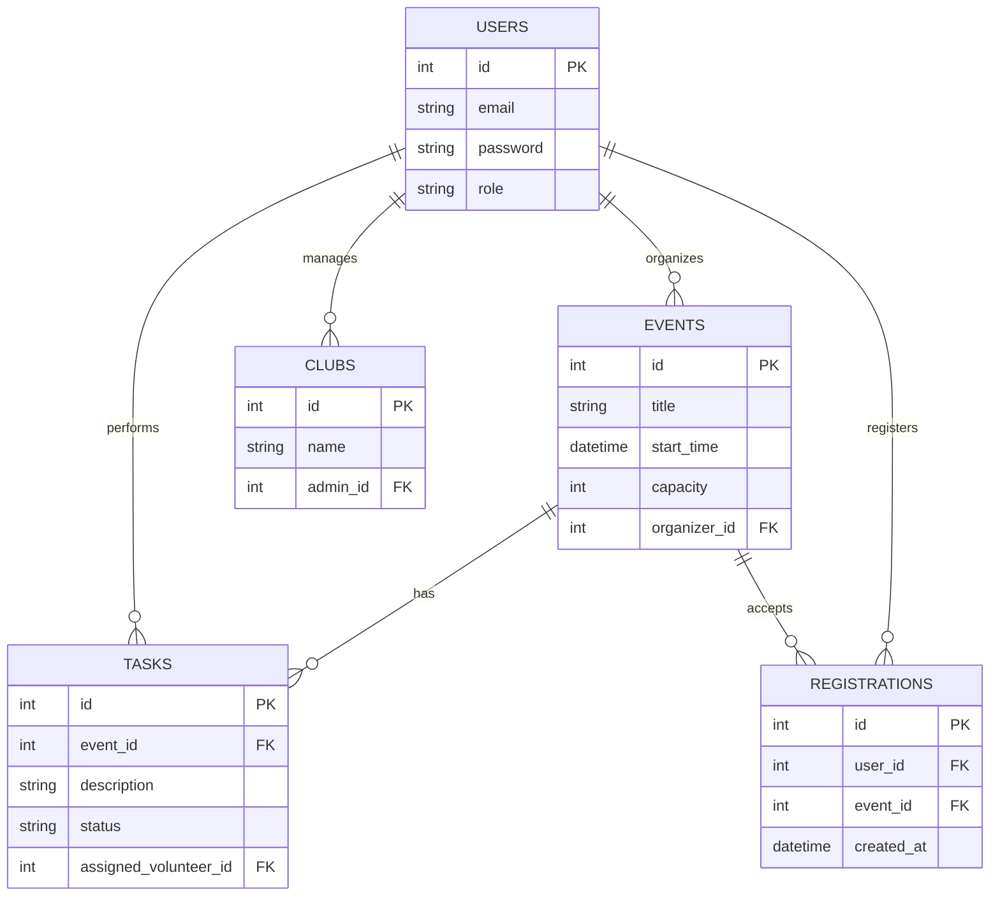

# ER Diagram (Database Schema)

The database schema for the Smart Campus Event Management System.

```mermaid
erDiagram
    USERS {
        int id PK
        string email
        string password
        string role
    }
    EVENTS {
        int id PK
        string title
        datetime start_time
        int capacity
        int organizer_id FK
    }
    TASKS {
        int id PK
        int event_id FK
        string description
        string status
        int assigned_volunteer_id FK
    }
    REGISTRATIONS {
        int id PK
        int user_id FK
        int event_id FK
        datetime created_at
    }
    CLUBS {
        int id PK
        string name
        int admin_id FK
    }

    USERS ||--o{ EVENTS : "organizes"
    EVENTS ||--o{ TASKS : "has"
    USERS ||--o{ TASKS : "performs"
    USERS ||--o{ REGISTRATIONS : "registers"
    EVENTS ||--o{ REGISTRATIONS : "accepts"
    USERS ||--o{ CLUBS : "manages"
```
