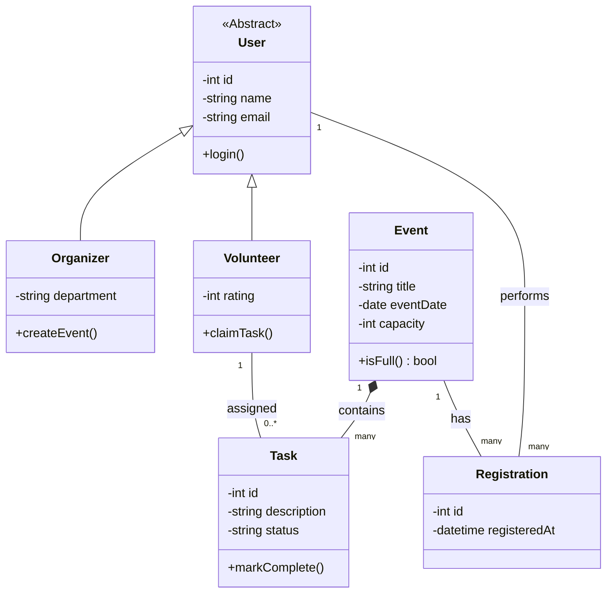

# Class Diagram (UML)

This diagram focuses on the domain model, highlighting inheritance (Users) and composition (Events/Tasks).

```mermaid
classDiagram
    class User {
        <<Abstract>>
        -int id
        -string name
        -string email
        +login()
    }

    class Organizer {
        -string department
        +createEvent()
    }

    class Volunteer {
        -int rating
        +claimTask()
    }

    User <|-- Organizer
    User <|-- Volunteer

    class Event {
        -int id
        -string title
        -date eventDate
        -int capacity
        +isFull() bool
    }

    class Task {
        -int id
        -string description
        -string status
        +markComplete()
    }

    class Registration {
        -int id
        -datetime registeredAt
    }

    Event "1" *-- "many" Task : contains
    Event "1" -- "many" Registration : has
    User "1" -- "many" Registration : performs
    Volunteer "1" -- "0..*" Task : assigned
```
