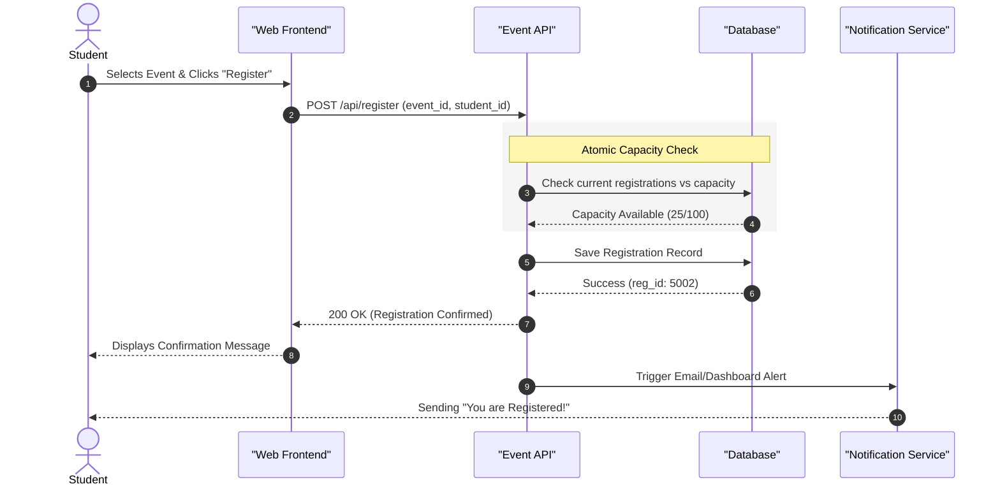

# Sequence Diagram

This diagram demonstrates the end-to-end flow of **Student Event Registration** and the subsequent **Volunteer Notification**.

```mermaid
sequenceDiagram
    autonumber
    actor Student
    participant UI as "Web Frontend"
    participant API as "Event API"
    participant DB as "Database"
    participant Notification as "Notification Service"

    Student->>UI: Selects Event & Clicks "Register"
    UI->>API: POST /api/register (event_id, student_id)
    
    rect rgb(245, 245, 245)
    Note over API, DB: Atomic Capacity Check
    API->>DB: Check current registrations vs capacity
    DB-->>API: Capacity Available (25/100)
    end

    API->>DB: Save Registration Record
    DB-->>API: Success (reg_id: 5002)
    
    API-->>UI: 200 OK (Registration Confirmed)
    UI-->>Student: Displays Confirmation Message

    API->>Notification: Trigger Email/Dashboard Alert
    Notification-->>Student: Sending "You are Registered!"
```
