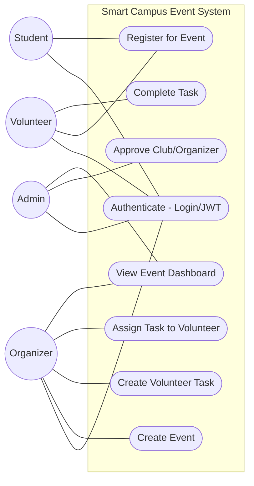

# Use Case Diagram

This diagram outlines the interactions between campus actors and the event management system.

```mermaid
flowchart LR
    %% Actors
    Admin((Admin))
    Organizer((Organizer))
    Volunteer((Volunteer))
    Student((Student))

    subgraph "Smart Campus Event System"
        UC1([Authenticate - Login/JWT])
        UC2([Approve Club/Organizer])
        UC3([Create Event])
        UC4([Register for Event])
        UC5([Create Volunteer Task])
        UC6([Assign Task to Volunteer])
        UC7([Complete Task])
        UC8([View Event Dashboard])
    end

    %% Relationships
    Admin --- UC1
    Admin --- UC2
    Admin --- UC8

    Organizer --- UC1
    Organizer --- UC3
    Organizer --- UC5
    Organizer --- UC6
    Organizer --- UC8

    Volunteer --- UC1
    Volunteer --- UC4
    Volunteer --- UC7

    Student --- UC1
    Student --- UC4
```
